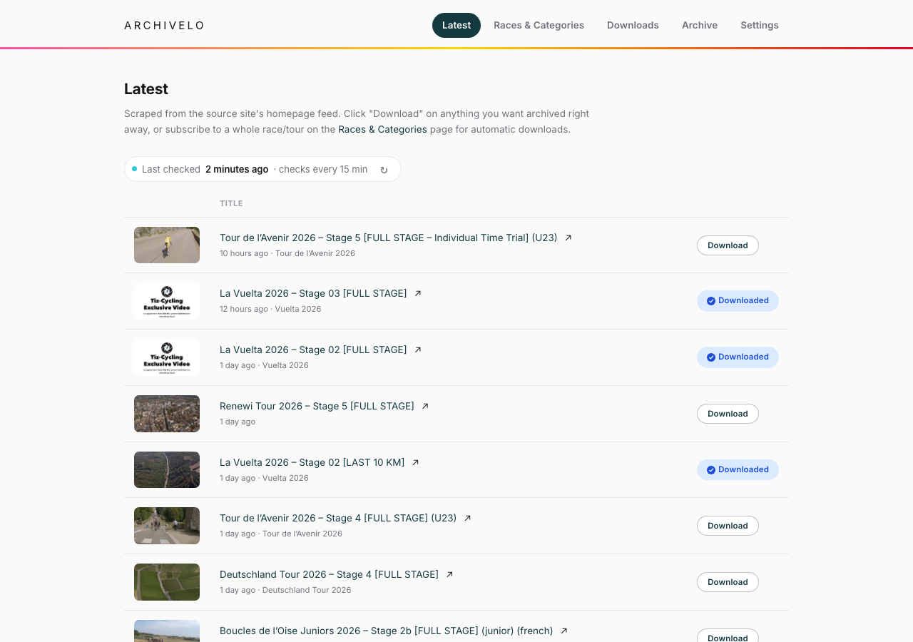

# Archivelo

A small, self-hosted archiver for cycling race videos. It browses a source site's uploads, lets you subscribe to specific races/categories, and automatically downloads new videos as they're published — via [yt-dlp](https://github.com/yt-dlp/yt-dlp) — into a folder structure on disk you control.

Runs as a single Docker container with a small FastAPI + HTMX web UI for tracking discovery and download status.



## Features

- **Latest Uploads** feed and a **Races & Categories** browser, both scraped live from the source site
- **Subscribe** to a category to auto-download new uploads going forward — browsing never triggers a download on its own, only subscribing or an explicit click does
- **Resumable downloads** — a stuck/stalled download is detected and killed automatically (independent OS-level watchdog, not just yt-dlp's own timeout) and retried with exponential backoff
- **Cancel / Resume / Delete** for an in-progress download, and **Redownload** for anything already saved
- **Archive** view of everything downloaded, with both download and upload dates
- Runtime-configurable **Settings** page (poll interval, retry limits, concurrency, source host) — no restart needed
- Survives container restarts cleanly: an interrupted download is requeued automatically on startup instead of silently stalling forever

## Quick start (Docker Compose)

```bash
curl -O https://raw.githubusercontent.com/inket/archivelo/main/docker-compose.yml
docker compose pull
docker compose up -d
```

The app will be available at `http://<host>:8000`. Two volumes get created next to `docker-compose.yml`: `./config` (database + log — small, worth backing up) and `./downloads` (the actual video files — large, point it at a different drive/mount if you want by changing the host-side path in `docker-compose.yml`).

To update later: `docker compose pull && docker compose up -d`.

### Configuration

All of these are set as `environment:` entries in `docker-compose.yml`:

| Variable | Default | Purpose |
|---|---|---|
| `SOURCE_BASE_URL` | *(the source site)* | Host to scrape, in case it ever moves |
| `POLL_INTERVAL_SECONDS` | `900` | How often subscribed categories are checked for new uploads |
| `RETRY_INTERVAL_SECONDS` | `300` | How often a failed discovery check is retried |
| `MAX_RETRIES` | `5` | Auto-retry attempts for a failed download before giving up |
| `MAX_CONCURRENT_DOWNLOADS` | `1` | How many downloads run at once |
| `DISCOVERY_PAGE_DEPTH` | `3` | How many listing pages deep to check per category |
| `PUID` / `PGID` | `0` / `0` (root) | Set to your host user's uid/gid so files under `./config` and `./downloads` aren't owned by root |
| `BASE_PATH` | *(empty)* | Set if serving behind a reverse proxy at a subpath, e.g. `/archivelo` for `https://example.org/archivelo` — see below |

Most of these (poll interval, retry limits, concurrency, source host) can also be changed later from the **Settings** page in the UI without restarting the container — the env var only supplies the initial value.

### Serving at a subpath

If you're putting Archivelo behind a reverse proxy at `https://example.org/archivelo` rather than its own domain/subdomain, set `BASE_PATH=/archivelo`. The proxy must **strip** that prefix before forwarding to the container — the app's routes are unprefixed internally; only the links/redirects it generates carry the prefix, so the browser's next request round-trips back through the proxy correctly.

```nginx
location /archivelo/ {
    proxy_pass http://archivelo:8000/;
}
```

If you're using a subdomain instead (`https://archivelo.example.org`), leave `BASE_PATH` empty — no path rewriting is involved.

## Local development

Requires Python 3.12+ and `yt-dlp`/`ffmpeg` on `PATH`.

```bash
python3 -m venv .venv
.venv/bin/pip install -r requirements.txt

cp .env.local.example .env.local   # or create your own; see app/config.py for all variables
set -a && source .env.local && set +a
.venv/bin/uvicorn app.main:app --reload
```

## How it works

- Discovery and downloads run as background threads inside the same process — no separate worker/queue service.
- The site's markup is scraped with a mix of `BeautifulSoup` and targeted regexes (some of its HTML is malformed enough that a strict tree parse misses content).
- Downloads shell out to `yt-dlp` as a subprocess rather than using its Python API, with an independent watchdog thread that kills and retries a download if it stalls — this proved more reliable than relying on yt-dlp's own internal timeouts.
- Every push to `main` builds and publishes the image to `ghcr.io/inket/archivelo` via [.github/workflows/docker-publish.yml](.github/workflows/docker-publish.yml) — deploying is just pulling, nothing gets built on the host.

## License

MIT — see [LICENSE](LICENSE).
